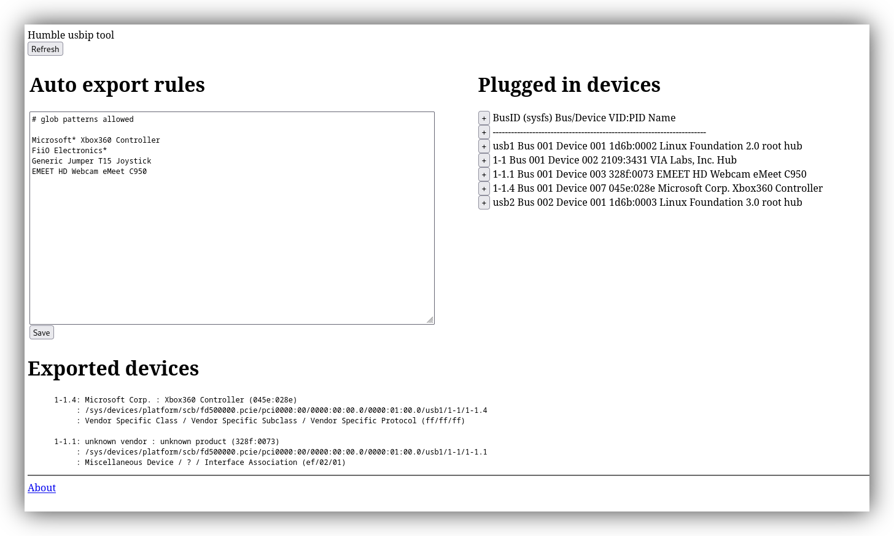

# TL;DR Install
curl https://raw.githubusercontent.com/eroldan/test1/refs/heads/main/one-line-installer.sh | bash

# Introduction
The repository contains an Ansible [playbook](playbook.yaml) that installs the required usbip tools for your Linux distribution, deploys the bundled web tool (see screenshot) and set up systemd services. The [`one-line-installer.sh`](one-line-installer.sh) script provides a quick way to set up Ansible and run the playbook locally. You can also use the Ansible playbook directly if you prefer.

## Personal use case
I use [Moonlight](https://moonlight-stream.org/)/[Sunshine](https://github.com/LizardByte/Sunshine) to stream Windows games which require special controllers. Created this repo to easy deploy a Raspberry Pi 4 as a USB gateway that quickly exports devices which I can network attach later in the Windows machine running the game.



# Requirements
1. Linux distribution is Debian, Ubuntu, Raspbian, Fedora, Rocky, Centos. Other systemd based distributions can be added easily.

# Rules
There are rules to automatically export matching USB device names. These rules trigger at the time a USB device is plugged in and if already plugged on boot.

# Web UI
http://yourserver:5000
Press the + to add to rules any plugged in device name.

# Windows
The driver for usbip for windows is located here https://github.com/vadimgrn/usbip-win2

# Security
Not secure. The usbip protocol doesn't have any kind of authorization. The web app does not provide authentication and executes commands as root (this may be remedied with some entries in /etc/sudoers and wrapping commands in sudo). Most parts of the code were written with AI and not reviewed.

# Debug
```
udevadm control --log-priority=debug
journalctl -u usbipd -f
```
"""
